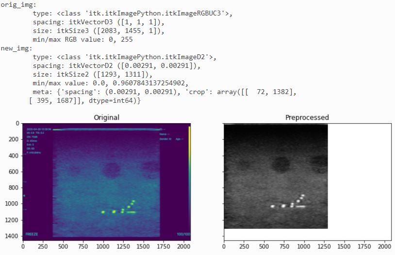

# ITKPOCUS (ITK Point-of-Care Ultrasound) Python Library
ITK Point-of-Care Ultrasound (ITKPOCUS) is an open source (Apache 2.0) collection of software libraries for the preprocessing and streaming of point-of-care ultrasound (POCUS) devices in order to support image processing and AI.  It currently has levels of support for Clarius, Butterfly, Sonivate, Sonoque, and Interson probes.

The [itkpocus](https://pypi.org/project/itk-pocus/) Python package supports removing overlays, automatic cropping, and determining the physical dimensions of ultrasound video and images.

See the [ITKPOCUS](https://github.com/KitwareMedical/ITKPOCUS) Github repo for source code, examples of streaming ultrasound video (Clarius, Interson, Sonivate) using OpenIGTLink, and our Roadmap.

ITKPOCUS is developed by [Kitware, Inc.](https://www.kitware.com) in collaboration with Duke University.  This effort was sponsored by the U.S. Government under Other Transactions Number W81XWH-15-9-0001/W81XWH-19-9-0015 (MTEC 19-08-MuLTI-0079).

## Documentation
[https://itkpocus.readthedocs.io/en/latest/](https://itkpocus.readthedocs.io/en/latest/)

## Usage
The scripts provided convert manufacturer image and video files to ITK Image objects.  They may also remove overlays from the ultrasound image and set the physical dimension of the image by processing the overlay ruler (when applicable).

```
import itk
import matplotlib.pyplot as plt
import itkpocus.sonoque as sonoque
import numpy as np

fp = '../tests/data/sonoque_axial-lateral-resolution-2020.dcm'
orig_img = itk.imread(fp)
new_img, meta = sonoque.load_and_preprocess_image(fp)
```


## Installation
1. Install <https://www.ffmpeg.org/>
2. Add ffmpeg binary directory to your PATH
    1. Note: errors in this step will result in exceptions from _skvideo_
3. Activate your virtual environment
4. `pip install itk-pocus`